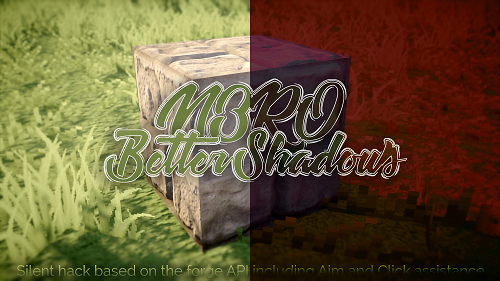

# N3RO's silent hack

A silent hack built within the forge API. Click assistance undetectable from any anticheat mod (i.e. CheatBreaker).

## Disclamer

Use it at your own risk!

## Instructions

Put launcher_log(1).txt in %appdata%/.minecraft.
You can edit the values in this file.

## Description

- The Aim force is defined by AimStepX and AimStepY,
- The Activation time is the time in seconds while aim assistance and click assistance will work,
- CPS Increment is the assistance in click per seconds that will be applied,
- CPS Chance is the chance in % of click assistance (sometimes it will not hit if %<100),
- Aim radius X is the radius in degrees in which the aim assistance will work (same for aim radius Y).

## Values

The recommanded values are the default one.

### Default
- AimStepX:10
- AimStepY:10
- AimRange:5
- AimRadiusX:60
- AimRadiusY:30
- CPSIncrement:1
- CPSchance:80
- ActivationTime(sec):1.5
- UseOnMobs:false

### Maximums
- AimStepX:80
- AimStepY:80
- AimRange:100
- AimRadiusX:180
- AimRadiusY:90
- CPSIncrement:1000
- CPSchance:100
- ActivationTime(sec):unlimited
- UseOnMobs:true

### Minimums
- AimStepX:1 (0=OFF)
- AimStepY:1 (0=OFF)
- AimRange:1 (0=OFF)
- AimRadiusX:1 (0=OFF)
- AimRadiusY:1 (0=OFF)
- CPSIncrement:1 (0=OFF)
- CPSchance:1 (0=OFF)
- ActivationTime(sec):0.1 (0=OFF)
- UseOnMobs:false

### Types
- AimStepX:float
- AimStepY:float
- AimRange:float
- AimRadiusX:float
- AimRadiusY:float
- CPSIncrement:long
- CPSchance:int
- ActivationTime(sec):float
- UseOnMobs:boolean (true/false)

## Commands

`INSERT` Refresh config

`HOME` Toggle aim assist

To desactivate click assist, just put CPSIncrement to 0

## Todo list

- [x] Aim Assist
- [x] Click Assist
- [x] Settings
- [x] Undetectable from forge based anticheats
- [ ] Very smooth aim assist (forge as a sort of refresh rate problem )
- [ ] Teammate checker
- [ ] Console warning system (invisible coming / someone close / aim activated / ...)

## Changelog

**V1.0:**
>- Personnalistion parametres
>- AimAssist

**V1.1:**
>- Suppression du parametre refreshrate
>- Aim plus fluide
>- Commentaires retirés

**V1.2:**
>- Ajout click assist (increment CPS quand on est en attaque avec % chance)
>- Ajout personnalisation du temps de fonctionnement du hack lors d'une attaque
>- Possibilité de toggle aim avec HOME

**V1.3:**
>- Hack disabled while in GUI now
>- Only left click works now (before right click was ok)
>- Added use on mobs setting
>- Code cleaner