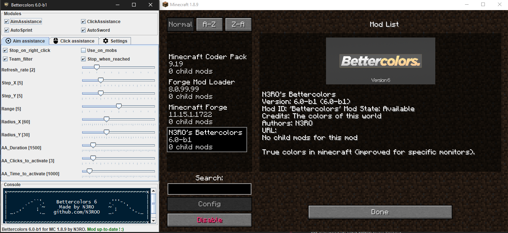

<h3 align="center">
  
</h3>

    
    
    
    
    
    

    
    
    

A silent "hack" built within the forge API. It bypasses powerful anticheats (forge mods and servers) to help you improve your gameplay.

## Disclaimer

I made this project to learn Java in a funny way. I started 2 years ago but the other repositories are, and will stay private. Only this repository will stay public because it can be used by newbies to improve their aim and their click rate without giving them a huge advantage. This has been made for educational purposes.

**Please make sure that the server you are playing on allows the use of this mod ! Use it at your own risk. I won't be responsible for anything you do wrong with this mod.**

## Features description

⚔️ **Aim assistance :** A smooth and human-like aim assistance 100% undetectable by any anti-cheat. It is invisible since it looks absolutely human. You can record videos while using it without any problem.

🖱️ **Click assistance :**  An human-like click assistance that sends REAL clicks, to help you click faster. It can bypass forge CPS counter mods by toggling packets.

📟 **External interface :** A clean external interface to configure the mod outside the minecraft client, so you can record without any problem !

📋 **Console :** Curious ? There is a console showing everything happening in the mod. 

🎎 **Teammate detection :** The mod find your teammates from any server game mode, and prevent modules to be activated on them.

🛠 **Settings :** You can configure every mod and all is saved in real time.

⚒ **Settings preset :** You can save, load, and create settings presets from a cool interface.

## Commands

- `HOME` : Toggle aim assist
- `PAGE_UP` : Toggle click assist
- `INSERT` : Toggle GUI

## Features help

- Aim assistance :
    - "Stop on right click" : it stops the aim assistance if you right click
    - The aim speed is defined by refresh rate,
    - The aim force is defined by step X and step Y,
    - The aim range sets the maximum distance to aim an entity,
    - The aim radius is the FOV in which you will aim at an entity,
    - "Stop when reached" : it means that when you aim at an entity, the aim assistance stops

- Click assistance :
    - "Packets" : Send packets instead of REAL clicks (**bypasses forge anti-cheats but riskier server side**)
    - "Only on entity" : It will click only if you are aiming an entity,
    - Additional clicks define how many clicks will be sent in addition to yours,
    - Chance is the probability of every artificial click to be sent,
    - Duration corresponds to the activation time of the click assistance,
    
- Common :
    - "Use on mobs" : Defines if the modules take into account mobs,
    - "Team filter" : Defines if the modules take into account teammates,
    - Clicks / Time to activate defines the number of clicks per time that you need to do in order to activate the modules.

## Values

The recommended values are the default one.

| Setting                     | Default       | Minimum     | Maximum   | Type    |
|-----------------------------|---------------|-------------|-----------|---------|
| AimAssist (AA)              | true          | false       | true      | boolean |
| ClickAssist (CA)            | true          | false       | true      | boolean |
| AA_RefreshRate (ms)         | 2             | 0           | 10        | integer |
| AA_StepX                    | 5             | 1 (0=OFF)   | 80        | float   |
| AA_StepY                    | 5             | 1 (0=OFF)   | 80        | float   |
| AA_Range                    | 5             | 1 (0=OFF)   | 100       | float   |
| AA_RadiusX                  | 60            | 1 (0=OFF)   | 180       | float   |
| AA_RadiusY                  | 30            | 1 (0=OFF)   | 90        | float   |
| AA_StopRightClick           | true          | false       | true      | boolean |
| AA_StopWhenReached          | false         | false       | true      | boolean |
| AA_Duration(ms)             | 2000          | 0           | 100000    | integer |
| AA_ClicksToActivate         | 2             | 0           | 20        | integer |
| AA_TimeToActivate(ms)       | 700           | 0           | 100000    | integer |
| CA_Addition                 | 2             | 1 (0=OFF)   | 10        | long    |
| CA_CPSChance                | 80            | 1 (0=OFF)   | 100       | integer |
| CA_Packets                  | false         | false       | true      | boolean |
| CA_OnlyOnEntity             | false         | false       | true      | boolean |
| CA_CPSActivationTime        | 1500          | 0.1 (0=OFF) | unlimited | float   |
| CA_CPSClicksToActivate      | 3             | 0           | unlimited | integer |
| CA_TimeToActivate(ms)       | 1500          | 0           | 10000     | integer |
| UseOnMobs                   | false         | false       | true      | boolean |
| TeamFilter                  | true          | false       | true      | boolean |

## Changelog

The changelog is available [here](CHANGELOG.MD).

## Found a bug ?

Go to the [issues](https://github.com/N3ROO/Bettercolors/issues) section, and open a new issue ! :)

## Developer section

This section show you how to get a working development environment.

### 1. Download your favorite IDE

It is easier to set up forge with [Eclipse](https://www.eclipse.org/neon/). Otherwise, you can use [IntelliJ](https://www.jetbrains.com/idea/) that is way better java IDE than Ecplise.

### 2. Set up forge & IDE

- Clone this project `git clone <link>`
- Go in the project directory

- Now if you use eclipse :
    - Open a terminal and type `.\gradlew setupDecompWorkspace`
    - Open a terminal and type `.\gradlew eclipse`
    - Open eclipse and switch your workspace to eclipse/

- And if you use IntelliJ IDEA :
    - Open IntelliJ IDEA, and open the "build.gradle" file as a project
    - A window will show up, change nothing but "create separate module per source set" that needs to be **UNchecked**
    - Wait for IntelliJ to process with gradle
    - Open a terminal and type `.\gradlew wrapper --gradle-version 3.4`
    - Now, in intelliJ, if gradlew shows up and says "Gradle projects need to be imported", then click on "import changes", and wait for the process to finish
    - Open the gradle tab (on the right), right click on "setupDecompWorkspace" (in Tasks/forgegradle), and click on "create bettercolors [setup...]", now in vm option, add "-Xmx4g -Xms4g", click apply, and then click on run (at the top left of IntelliJ window)
    - In the same tab, execute "genIntellijRuns"
	- Finally, at the top, click on "Minecraft Client" and select "edit configurations". In "Use classpath of module" select "dev.nero.bettercolors.main.Bettercolors".
	- Now you should be able to launch minecraft through intelliJ (if it does not wok, make sure that you use Java JDK 8<->10)

Now it should be done (please refer to [FORGE-INSTRUCTIONS.txt](FORGE-INSTRUCTIONS.txt) or this [youtube video](https://www.youtube.com/watch?v=G2aPT36kf60) if you have any problem)

### 3. Build the .jar

Open a terminal and write `.\gradlew build`.

### 4. Contributing

If you want to contribute, make sure to :
- keep the same coding style that is already used (plus headers describing every function),
- describe what is the purpose of your pull request.
