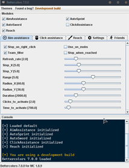

<h3 align="center">
  
</h3>

    
    
    

    
    

A silent "hack" built with Fabric. It bypasses powerful anticheats to help you improve your gameplay.

<h3 align="center">
  <b>Reach 💥 Aim Assistance 💥 Click Assistance 💥 Auto Sprint 💥 Auto Sword 💥 Triggerbot / Autoclick</b>
    
  
</h3>

## Last major changes

- Added **Reach**
- Added **Friend list**
- Added **Triggerbot** (can be seen as an autoclicker)

See [details](CHANGELOG.md)

## Disclaimer

I made this project to learn Java in a funny way. I started 2 years ago but the other repositories are, and will stay private. Only this repository will stay public because it can be used by newbies to improve their aim and their click rate without giving them a huge advantage. This has been made for educational purposes.

**Please make sure that the server you are playing on allows the use of this mod ! Use it at your own risk. I won't be responsible for anything you do wrong with this mod.**

## About this mod

The detailed documentation is accessible on the [wiki](https://github.com/N3ROO/Bettercolors/wiki).

**Users**
- [Features](https://github.com/N3ROO/Bettercolors/wiki/2.-Features)
- [How to install it](https://github.com/N3ROO/Bettercolors/wiki/1.-User-section)
- [How to use it](https://github.com/N3ROO/Bettercolors/wiki/1.-User-section)
- [Last updates](https://github.com/N3ROO/Bettercolors/wiki/4.-Updates-&-Support-roadmap)
- [Found a bug?](https://github.com/N3ROO/Bettercolors/issues/new?assignees=&labels=&template=bug_report.md&title=)
- [A question, a request?](https://github.com/N3ROO/Bettercolors/issues/new?assignees=&labels=&template=feature_request.md&title=)
- [Is Bettercolors safe?](https://github.com/N3ROO/Bettercolors/wiki/0.-What-makes-Bettercolors-undetectable)

**Developers:**
- [How to set up your development environment](https://github.com/N3ROO/Bettercolors/wiki/3.-Developer-section)
- [Updates & support roadmap](https://github.com/N3ROO/Bettercolors/wiki/4.-Updates-&-Support-roadmap)
- [How to contribute](https://github.com/N3ROO/Bettercolors/wiki/3.-Developer-section#contributing)

## Credits & Acknowledgements

- [@N3ROO](https://github.com/N3ROO)  - *Main developer*
- [@patricktelling](https://github.com/patricktelling) - *Pointed out important issues (#27 & #28)*
- [@shorebre4k](https://github.com/shorebre4k) - *Added option to change the GUI's toggle key (issue #15 & pull request #35)*
